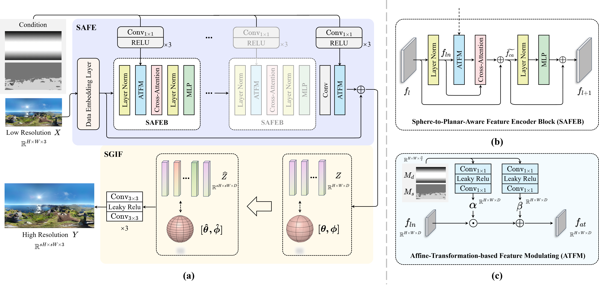

# FAOR: Fast Omni-Directional Image Super-Resolution: Adapting the Implicit Image Function with Pixel and Semantic-Wise Spherical Geometric Priors

>This is the official implementation for the paper FAOR: 
["Fast Omni-Directional Image Super-Resolution: Adapting the Implicit Image Function with Pixel and Semantic-Wise Spherical Geometric Priors"]

## Contents
- [Introduction](#introduction)
  - [Overview](#overview)
  - [Visual Results](#visual-results)
- [Requirements and dependencies](#requirements-and-dependencies)
- [Data Preparation](#data-preparation)
- [Model](#model)
- [Testing](#testing)
- [Training](#training)

## Introduction
>We proposes a new ODI-SR model characterized by its capacity to perform Fast and Arbitrary-scale ODI-SR processes, denoted as FAOR. The key innovation lies in adapting the implicit image function from the planar image domain to the ERP image domain by incorporating spherical geometric priors at both the latent representation and image reconstruction stages, in a low-overhead manner. Specifically, at the latent representation stage, we adopt a pair of pixel-wise and semantic-wise sphere-to-planar distortion maps to perform affine transformations on the latent representation, thereby incorporating it with spherical properties. Moreover, during the image reconstruction stage, we introduce a geodesic-based resampling strategy, aligning the implicit image function with spherical geometrics without introducing additional parameters. As a result, the proposed FAOR outperforms the state-of-the-art ODI-SR models with a much faster inference speed.

### Overview
<p align="center">
  
</p>

### Visual Results
<p align="center">
  
</p>

## Requirements and dependencies
- Python 3.8 (recommend to use [Anaconda](https://www.anaconda.com/))
- Pytorch 2.1.2
- basicsr, pyyaml, tqdm, opencv-python, numpy

### Installation
```
conda create -n faor python=3.8
conda activate faor

pip install -r requirements.txt
```

## Data Preparation
<!-- - Download the [datasets](https://mega.nz/file/6QkBBCZY#pV3IJe-c9fzmZ7cxSfhpOaYxg_OzLX6F5q4UiJYjFNw).  -->
- For convenience, we have initially provided the [test set](https://mega.nz/file/6QkBBCZY#pV3IJe-c9fzmZ7cxSfhpOaYxg_OzLX6F5q4UiJYjFNw) of the ODI-SR dataset for testing.
- Put the datasets into the data folder as follows:
```
data
├── odisr
│   ├── test
│   │   ├── HR
│   │   ├── map
│   ├── train
│   │   ├── HR
│   │   ├── map
│   └── validation
│       ├── HR
│       └── map

```

## Model
- Download the pre-trained model:

Model | Download
:-: | :-:
FAOR | [MEGA](https://mega.nz/file/ydtznTja#8-Mklfuim6bp770rmacRD65251zcO8RGe-XS_Bfui2E)

- Put the checkpoint into the save folder as follows:

```
save
├── pre-trained_models
│   └── train-SEG-S4-I128-B6.pth
```
<!-- ## Quick Demo
Use FAOR to test 0803.png in test_imgs folder for scale x2,x4,x8,x16, results will be saved in exp_folder.
```commandline
python  ope_demo_zoom.py --exp_folder save/train_edsr-ope --ckpt_name train-SEG-S4-I128-B6.pth.pth --hr_path test_imgs/0803.png --scale_list 4 6 8 12
``` -->

## Testing
Given HR ODI, test FAOR set for scale x2, x4, x8 and x16. You can specify scaling factor in test config. Visual results will be saved in vis_res/odisr
```commandline
python test_auto.py --test_config configs/test-configs/test_ODI-SEG-SR.yaml --gpu 0
```
<!-- Given LR ODI, test FAOR for specific scaling factor.
```commandline
python test_auto.py --test_config configs/test-configs/test_ODI-SEG-SR.yaml --gpu 0
``` -->

## Training
```commandline
sh train.sh
```

